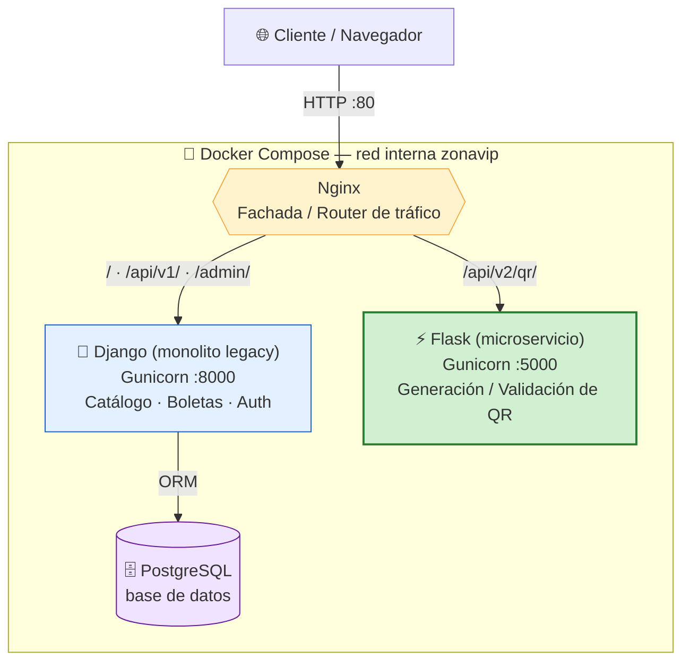

# Migración a Microservicios (Strangler Pattern)

**Curso:** Arquitectura de Software 2026 — Prof. Nicolás Ramírez Vélez
**Entrega:** Taller 02 — El Patrón Estrangulador (Migración Híbrida de Monolito a Microservicios)

Esta página documenta cómo ZonaVip evolucionó de un **monolito Django** a
una **arquitectura híbrida** en la que un módulo crítico fue extraído a un
**microservicio Flask** independiente, aplicando el *Strangler Fig Pattern*
(Patrón del Estrangulador) de Martin Fowler.

---

## 1. Matriz de Decisión y Selección

El principio rector del patrón es: **no todo debe ser un microservicio.** Se
evaluaron los módulos del sistema con tres criterios (frecuencia de cambio,
consumo de recursos/CPU y acoplamiento con la base de datos) para elegir un
único candidato a estrangular.

| Módulo | Consumo de Recursos (CPU) | Frecuencia de Cambio | Acoplamiento a la BD | Decisión |
|---|---|---|---|---|
| **Autenticación / Usuarios** | Baja | Baja | Muy Alto (`AUTH_USER_MODEL`, FKs en todo el modelo) | **Mantener en Django** |
| **Catálogo de Eventos** | Media | Media | Muy Alto (`Evento`, `Localidad`, `Organizador`) | **Mantener en Django** |
| **Reserva / Cancelación de Boletas** | Media | Alta | Muy Alto (transacciones, `select_for_update`, cupos) | **Mantener en Django** |
| **Generación / Validación de Códigos QR** | **Muy Alta** | Media | **Muy Bajo** (solo necesita `boleta_id` + `codigo_qr`) | **✅ Estrangular (Flask)** |

### Justificación de la elección

Se seleccionó el módulo de **Generación / Validación de Códigos QR** como
candidato ideal a estrangular por la combinación de dos factores:

1. **Consumo de recursos muy alto.** Renderizar la matriz de un código QR y
   codificarla como imagen PNG es una operación **CPU-intensiva**. Dentro del
   monolito, ejecutarse en el mismo proceso WSGI que atiende reservas y
   catálogo compite por CPU y puede **bloquear el hilo principal de Django**,
   degradando el tiempo de respuesta del resto de usuarios (*timeouts*),
   justo el escenario que el patrón busca aislar.

2. **Acoplamiento a la base de datos muy bajo.** A diferencia de reservas o
   catálogo —que dependen fuertemente del ORM, de transacciones atómicas y de
   `select_for_update` sobre cupos—, la generación del QR solo necesita dos
   datos primitivos: el `boleta_id` y el `codigo_qr` (un UUID). **No lee ni
   escribe tablas del monolito**, por lo que puede vivir en un proceso
   separado sin compartir la base de datos ni romper una transacción.

Los otros tres módulos se **mantienen en Django** precisamente porque su
acoplamiento a la base de datos es muy alto: extraerlos exigiría fragmentar
transacciones y sincronizar datos entre servicios, un costo desproporcionado
frente al beneficio. El QR, en cambio, es un *cuello de botella aislable*: el
mejor perfil posible para el primer corte del estrangulador.

> **Impacto esperado en el sistema:** al mover el render de QR fuera del
> proceso de Django, el consumo de CPU/memoria de esa tarea queda **aislado**
> en un contenedor propio, escalable de forma independiente (p. ej. subiendo
> los *workers* de Gunicorn del microservicio sin tocar el monolito). El
> monolito deja de sufrir *timeouts* por picos de generación de imágenes, y
> el nuevo servicio puede desplegarse/actualizarse por separado.

---

## 2. Separación Técnica: ¿cómo se logró?

La coexistencia de ambos frameworks se resolvió con **tres piezas de
infraestructura** orquestadas por Docker Compose.

### 2.1. El microservicio Flask (la lógica extraída)

- Ubicación: [`services/qr_service/`](../../services/qr_service).
- API REST que recibe y responde **JSON nativo**.
- Lógica de negocio aislada en un módulo de dominio puro
  (`domain/qr_engine.py`) que **no depende de Flask**, replicando la misma
  disciplina de capas del monolito.
- **Manejo de errores estructurado** para garantizar resiliencia: todos los
  fallos devuelven JSON con `{ "error": ..., "tipo": ... }` y el código HTTP
  correcto (400 / 404 / 405 / 500), nunca un *stacktrace* crudo.
- Firma de los QR con **HMAC-SHA256** para poder validar después que un QR
  fue emitido genuinamente por ZonaVip.

| Método | Ruta (pública, tras Nginx) | Descripción |
|---|---|---|
| `GET`  | `/api/v2/qr/health`  | Health check |
| `POST` | `/api/v2/qr/generar` | Genera un QR (PNG base64) para una boleta |
| `POST` | `/api/v2/qr/validar` | Valida la firma HMAC de un payload de QR |

Ejemplo de respuesta de `POST /api/v2/qr/generar`:

```json
{
  "boleta_id": 1,
  "codigo_qr": "a1b2c3",
  "payload": "ZONAVIP|1|a1b2c3|9f0a1b2c3d4e5f60",
  "imagen_base64": "data:image/png;base64,iVBORw0KGgo...",
  "formato": "PNG",
  "generado_en_ms": 4.12
}
```

### 2.2. Contenedorización (Docker)

- Un [`Dockerfile`](../../Dockerfile) **independiente** para el monolito
  Django (Gunicorn, 3 workers).
- Un [`Dockerfile`](../../services/qr_service/Dockerfile) **independiente**
  para el microservicio Flask (Gunicorn, 2 workers, usuario no-root).
- El [`docker-compose.yml`](../../docker-compose.yml) levanta **ambos
  servicios** junto a la base de datos (PostgreSQL) y a Nginx.

### 2.3. Orquestación del tráfico (Nginx)

Nginx actúa como **fachada / punto único de entrada** (puerto 80) y bifurca
el tráfico según la URL. Es la esencia del patrón: el cliente sigue llamando
a un solo host, sin enterarse de que una ruta ya vive en otro servicio.

```nginx
# infra/nginx/nginx.conf  (fragmento)
upstream django_web       { server django_web:8000; }
upstream flask_qr_service { server flask_qr_service:5000; }

server {
    listen 80;

    # RUTA ESTRANGULADA -> Flask  (se declara primero: tiene prioridad)
    location /api/v2/qr/ {
        proxy_pass http://flask_qr_service;
    }

    # MONOLITO LEGACY -> Django  (todo lo demás, incl. /api/v1/)
    location / {
        proxy_pass http://django_web;
    }
}
```

| Ruta entrante | Se enruta a | Servicio |
|---|---|---|
| `/api/v1/...` (y `/api/...`, `/admin/`) | `django_web:8000` | Monolito Django (legacy) |
| `/api/v2/qr/...` | `flask_qr_service:5000` | Microservicio Flask (estrangulado) |

> El monolito conserva sus rutas bajo `/api/` **y** las expone además bajo el
> prefijo versionado `/api/v1/` (ver `config/urls.py`), de modo que la
> convención de versionado del taller —`/api/v1/` legacy vs.
> `/api/v2/funcionalidad` estrangulada— quede explícita en el ruteo.

---

## 3. Diagrama de la nueva arquitectura



**Flujo:** el cliente siempre habla con Nginx en el puerto 80. Nginx inspecciona
la URL: si empieza por `/api/v2/qr/`, la reenvía al **microservicio Flask**
(módulo estrangulado); cualquier otra ruta va al **monolito Django**, que
sigue siendo el dueño de la base de datos. El microservicio de QR es *stateless*
y no toca la BD, por lo que escala de forma independiente.

---

## 4. Cómo levantar y probar el entorno

```bash
# Levantar toda la topología (Django + Flask + Postgres + Nginx)
docker compose up --build

# Ruta legacy -> Django
curl http://localhost/api/v1/eventos/

# Ruta estrangulada -> Flask
curl http://localhost/api/v2/qr/health
curl -X POST http://localhost/api/v2/qr/generar \
     -H "Content-Type: application/json" \
     -d '{"boleta_id": 1, "codigo_qr": "a1b2c3"}'
```

El microservicio incluye una batería de **10 pruebas** (dominio puro +
contrato HTTP/JSON, incluyendo los errores 400/404/405). Ver
[`services/qr_service/README.md`](../../services/qr_service/README.md).

---

## 5. Evolución futura (siguiente corte del estrangulador)

El patrón es **incremental**: agregar un nuevo microservicio no requiere tocar
el monolito, solo añadir un `location` en Nginx y un servicio en Compose. El
candidato natural para el siguiente corte es el módulo de **Pagos** (`Pago`,
ya diseñado para la Entrega 2): también es un proceso pesado, con dependencias
externas (pasarela) y susceptible de aislarse detrás de una
`PasarelaPagoFactory`, como se anticipa en la [wiki de patrones creacionales](04-Patrones-Creacionales.md).
